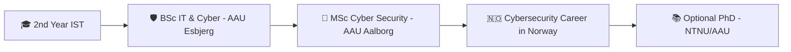

<div align="center">

# 👋 Hey, I'm Timo

### 🛡️ Future Cybersecurity Specialist | 💻 Full-Stack Developer | 🤖 AI Tool Builder


</div>

---

## 🚀 What I'm Building

```typescript
const currentProjects = {
  primary: "Hand-of-Odin",
  description: "Node.js CLI AI coding assistant optimized for Next.js",
  status: "Phases 1-6 Complete | 7-10 In Progress",
  features: [
    "GitHub Models API Integration",
    "Smart file operations (read/write)",
    "Shell command execution",
    "GitHub OAuth Device Flow",
    "Custom skill system (coming soon)",
  ],
  vision: "Best OpenCode alternative with everything-claude-code features"
};
```

### 🎯 Active Focus Areas
- 🏗️ **Hand-of-Odin**: Building the ultimate Next.js AI coding assistant
- 🏆 **Hackathon Prep**: Mastering Next.js + TypeScript + Tailwind + Supabase stack
- 🔐 **Cybersecurity**: Learning offensive/defensive techniques via OverTheWire Bandit
- 📱 **NetStudy**: Flutter app for my school's maturita exam prep (IST program)

---

## 💼 Tech Arsenal

### 🎨 Frontend & Mobile


### ⚙️ Backend & Database


### 🛠️ Languages & Tools


### 🎨 Design & 3D


---

## 📊 GitHub Statistics

<div align="center">


</div>

---

## 🏆 GitHub Trophies

<div align="center">


</div>

---

## 🎯 Current Goals & Roadmap



### 📅 2024-2026 Milestones
- ✅ Complete Hand-of-Odin Phases 1-6
- 🔄 Master Next.js + TypeScript + Supabase stack
- 🎯 Compete in Bratislava & online hackathons
- 🚀 Launch Hand-of-Odin on Gumroad
- 📱 Publish NetStudy app to Google Play
- 🔐 Progress through OverTheWire wargames

---

## 💡 What I'm Learning Right Now

<table>
<tr>
<td width="50%">

### 🔐 Cybersecurity
- Offensive & Defensive techniques
- CTF challenges (OverTheWire Bandit)
- Penetration testing fundamentals
- Network security (Cisco/Packet Tracer)

</td>
<td width="50%">

### 💻 Development
- Next.js App Router architecture
- Drizzle ORM with Supabase
- AI agent workflows & sub-agents
- CLI tool development with Node.js

</td>
</tr>
</table>

---

## 🤝 Let's Collaborate!

I'm actively looking for:
- 👥 **Hackathon teammates** (Next.js/TypeScript focus)
- 🌟 **Open source contributors** for Hand-of-Odin
- 💼 **Mentorship** in AI workflows and cybersecurity
- 🎯 **Project ideas** combining AI, security, or web dev

---

## 📫 Connect With Me

<div align="center">

[](https://linkedin.com/in/timotej-tipary)
[](https://discord.gg/timo_t_q)
[](https://github.com/timo-t-q)

</div>

---

## ⚡ Fun Facts

- 🎪 Former **camp animator** with experience teaching kids
- 🖨️ **3D printing instructor** - from modeling to print
- 🇸🇰 Based in **Bratislava, Slovakia** (Petržalka)
- 🇳🇴 Planning to relocate to **Norway** for cybersecurity career
- 🎓 **AAU Denmark** is my target university (Esbjerg → Aalborg)
- 🤖 Building AI tools while learning to hack them securely

---

<div align="center">

### 💭 Random Dev Wisdom


---


**"First, solve the problem. Then, write the code."** - John Johnson

</div>

---

<div align="center">

⭐ **From [timo-t-q](https://github.com/timo-t-q)** with 💻 and ☕

</div>
